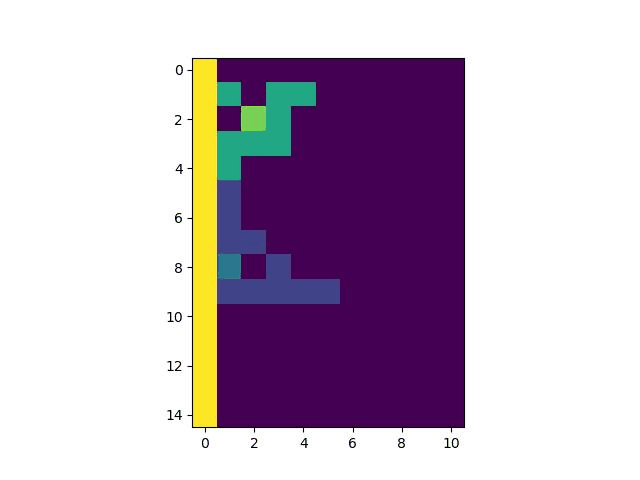
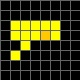
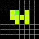
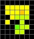
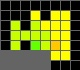

# Tableturf(ナワバトラー)　発火表作成ツール

このリポジトリは、Splatoon3のナワバトラーのカードの発火パターンを分析し結果を出力するためのPythonスクリプトを提供します。

## BackGround

ナワバトラーの150枚以上のカードの中から15枚を選ぶデッキ構築は非常に難しく時間がかかります。しかし、相性が良いカードは必ず存在し、それを簡単に見つけるために本スクリプトを作成しました。

相性が良いカードをSPマスを発火させ合うものと定義し、本スクリプトはそれを全列挙することを目指します。得られた情報は強いデッキを組むための判断材料として使用します。


## Setup

このリポジトリをクローンしてください。

```bash
git clone https://github.com/gigisample/Tableturf-Battle-Fire.git
```

python3とjupyter-notebook, 必要なパッケージ(numpy, pandas, matplotlib, opencv等)がインストールされた端末の動作を想定しています。
しかし、コンテナを使うことで環境構築をスキップできます。

```bash
cd Tableturf-Battle-Fire
docker build -t my-jupyter-notebook .
docker run -p 8888:8888 -v "$PWD":/usr/src/app my-jupyter-notebook
```
コンテナを立ち上げた後、ブラウザで以下URLにアクセスします。

```bash
http://127.0.0.1:8888
```

## Usage

前提条件として入力データが以下ディレクトリに存在します。

```
./data/input/cardlist.csv
```

`Firecombo_todata_toimg.ipynb`を開いて上からセルを順に実行します。csvや画像の結果が以下のディレクトリ格納されます。


カードの組み合わせパターン
```
./data/output/combolist.csv
```
発火表
```
./data/output/combofire_append.csv
```
カード画像
```
./img/fire_img/card_img_1
./img/fire_img/card_img_2
```
発火後の画像
```
./img/fire_img/
```

# Process Overview
簡単な処理概要です。


### 0. 入力データ

以下のようなカード名と2次元のマス配列があるcsvファイルを使用します。マス配列は0が空白、1が通常マス、2がSPマスを示します。

| No | 日本語名 | … | マス配列 |
| ------- | ------- | ------- | ------- |
| 1  | ヒーローシューター  | …  | [[0, 0, 0, 0, 0, 0, 0, 0], [0, 0, 0, 0, 0, 0, 0, 0], [0, 1, 1, 1, 1, 1, 0, 0], [0, 1, 1, 1, 2, 1, 0, 0], [0, 0, 1, 0, 0, 0, 0, 0], [0, 1, 0, 0, 0, 0, 0, 0], [0, 0, 0, 0, 0, 0, 0, 0], [0, 0, 0, 0, 0, 0, 0, 0]]|
| 2  | ボールドマーカー  | …  |　[[0, 0, 0, 0, 0, 0, 0, 0], [0, 0, 0, 0, 0, 0, 0, 0], [0, 0, 1, 2, 0, 1, 0, 0], [0, 0, 1, 1, 1, 1, 0, 0], [0, 0, 0, 1, 0, 1, 0, 0], [0, 0, 0, 0, 0, 0, 0, 0], [0, 0, 0, 0, 0, 0, 0, 0], [0, 0, 0, 0, 0, 0, 0, 0]] |
| 3  | わかばシューター  | …  | [[0, 0, 0, 0, 0, 0, 0, 0], [0, 0, 0, 0, 0, 0, 0, 0], [0, 0, 0, 0, 0, 0, 0, 0], [0, 0, 1, 2, 1, 0, 0, 0], [0, 0, 1, 0, 0, 0, 0, 0], [0, 0, 0, 0, 0, 0, 0, 0], [0, 0, 0, 0, 0, 0, 0, 0], [0, 0, 0, 0, 0, 0, 0, 0]] |


### 1. カードの組み合わせ表を作成

2枚のカードの組み合わせの表を事前に作成します。
ナワバトラーのルール上、同名カード2枚の組み合わせは除きます。

### 2. 発火表作成

2枚のカードの置き方を全網羅し発火パターンを調べます。


例えば、トライストリンガーとLACT-450の発火パターンを調べる場合のイメージ。


壁を絡める発火を調べる場合は以下のようにSPマスを壁に結合させます。





### 3. 発火表の情報付与

発火後の状態を分析しやすいように、以下の評価指標を発火表に付与します。

- 発火タイプ (壁を絡めた発火の場合どの種類の壁による発火か)
- 同時発火 (発火させるカード側も発火しているか)
- マス数
- 長軸
- 短軸
- 面積 (カードを最小矩形で囲った時の矩形の面積)
- 密度 (マス数÷面積)
- 穴があるか

最終的に以下のcsvが出力がされます。
|   No |   組み合わせ番号 |   シーケンス番号 | 発火するカード     | 発火させるカード         | 発火成立真偽   | 発火同時成立真偽   | 発火タイプ   | マス配列                                                                                                                                                                                                                                                                                                                         |   マス |   長軸 |   短軸 |   面積 |     密度 | 穴    |
|-----:|-----------------:|-----------------:|:-------------------|:-------------------------|:---------------|:-------------------|:-------------|:---------------------------------------------------------------------------------------------------------------------------------------------------------------------------------------------------------------------------------------------------------------------------------------------------------------------------------|-------:|-------:|-------:|-------:|---------:|:------|
|    0 |                0 |                0 | ヒーローシューター | ボールドマーカー         | True           | False              | 壁なし       | [[0, 0, 0, 0, 0, 0, 0], [0, 1, 1, 1, 1, 1, 0], [0, 1, 1, 1, 2, 1, 0], [0, 0, 1, 3, 3, 3, 0], [0, 1, 0, 0, 3, 0, 0], [0, 0, 0, 4, 3, 3, 0], [0, 0, 0, 3, 3, 0, 0], [0, 0, 0, 0, 0, 0, 0]]                                                                                                                                         |     21 |      6 |      5 |     30 | 0.7      | False |
|    1 |                0 |                1 | ヒーローシューター | ボールドマーカー         | True           | False              | 曲がり角3    | [[0, 0, 0, 0, 0, 0, 0, 0], [0, 0, 0, 1, 0, 1, 1, 0], [0, 3, 0, 3, 1, 1, 1, 0], [0, 3, 3, 3, 3, 1, 1, 0], [0, 3, 0, 4, 3, 2, 1, 0], [5, 5, 5, 5, 5, 1, 1, 0], [5, 5, 5, 5, 5, 0, 0, 0]]                                                                                                                                           |     21 |      6 |      5 |     30 | 0.7      | False |
|    2 |                1 |                0 | ヒーローシューター | わかばシューター         | True           | False              | 壁なし       | [[0, 0, 0, 0, 0, 0, 0], [0, 1, 1, 1, 1, 1, 0], [0, 1, 1, 1, 2, 1, 0], [0, 0, 1, 3, 4, 3, 0], [0, 1, 0, 3, 0, 0, 0], [0, 0, 0, 0, 0, 0, 0]]                                                                                                                                                                                       |     16 |      5 |      4 |     20 | 0.8      | False |


### 4. カード画像出力

以下のような可視化用のカード画像と発火後の画像を出力します。

ヒーローシューター



ボールドマーカー



ヒーローシューターがボールドマーカーによって発火させられる場合





## Extra


作成した発火表を[Power BIのレポート](https://app.powerbi.com/view?r=eyJrIjoiYjQyY2FiMmQtNzRiMy00Mjg5LTg3ZWMtZTM4N2E3Njg2Njc4IiwidCI6IjdhNWU4NmVhLTY4NDItNGVhMy04YTdlLWViMGZhOWY4ZTMzYSJ9)で可視化しました。(最初の表示に少し時間がかかります。)


詳細は[Qiitaの記事](https://qiita.com/gigi/items/5099700c7af50c4b6350)に記述しました。
